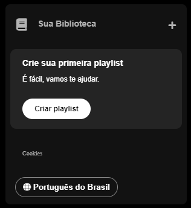

"# Imers�o FRONT-END da Alura"  

Nesta imersão, será ensinado como a programar do zero utilizando HTML e CSS, desenvolvendo um projeto prático. O objetivo é recriar a página inicial do Spotify, aplicando conceitos fundamentais de estruturação e estilização de páginas web.

Aula 01: HTML, CSS e JavaScript na Prática

📅 Data: 27/01

Na primeira aula, foi apresentado o projeto de recriação da página inicial do Spotify, utilizando HTML e CSS. Foi feita uma revisão das diferenças entre HTML, CSS e JavaScript, destacando o papel de cada tecnologia no desenvolvimento web.

Além disso, começou-se a construção do menu lateral (sidebar navigation), onde foi ensinado como adicionar a logo e estruturar os primeiros elementos da navegação, com as opções "Início" e "Busca".

Aula 02: Estilização Avançada e Posicionamento – Transformando Layouts

📅 Data: 28/01

Na segunda aula, o foco foi no aperfeiçoamento do menu lateral da página, aprofundando-se nos conceitos de CSS, como posicionamento, layouts e a técnica do Flexbox. Foram exploradas formas de organizar os elementos de maneira responsiva e visualmente atraente, garantindo uma melhor experiência para o usuário.

