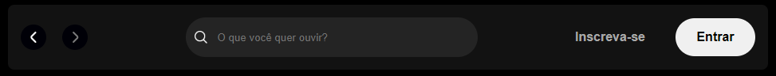
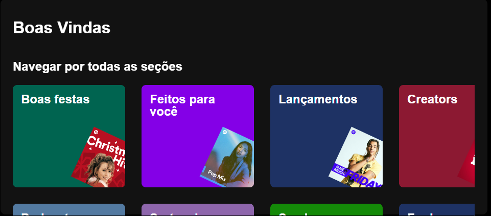

<h1>Imersão FRONT-END da Alura</h1>

Nesta imersão, será ensinado como a programar do zero utilizando HTML e CSS, desenvolvendo um projeto prático. O objetivo é recriar a página inicial do Spotify, aplicando conceitos fundamentais de estruturação e estilização de páginas web.

<h3>Aula 01: REVISÃO: HTML, CSS E JS NA PRÁTICA</h3>

📅 Data: 27/01

Na primeira aula, foi apresentado o projeto de recriação da página inicial do Spotify, utilizando HTML e CSS. Foi feita uma revisão das diferenças entre HTML, CSS e JavaScript, destacando o papel de cada tecnologia no desenvolvimento web.

Além disso, começou-se a construção do menu lateral (sidebar navigation), onde foi ensinado como adicionar a logo e estruturar os primeiros elementos da navegação, com as opções "Início" e "Busca".

<h3>Aula 02: ESTILO AVANÇADO E POSICIONAMENTO: TRANSFORMANDO LAYOUTS</h3>

📅 Data: 28/01

Na segunda aula, o foco foi no aperfeiçoamento do menu lateral da página, aprofundando-se nos conceitos de CSS, como posicionamento, layouts e a técnica do Flexbox. Foram exploradas formas de organizar os elementos de maneira responsiva e visualmente atraente, garantindo uma melhor experiência para o usuário.

<h3>Aula 03: LAYOUT FLEXBOX, PSEUDO-CLASSES E RESPONSIVIDADE EM CSS</h3>

📅 Data: 29/01

Na terceira aula, o foco foi aprofundar a organização do código, explorando mais detalhadamente o CSS. Foram introduzidos conceitos como variáveis no CSS, que ajudam a tornar o código mais dinâmico e fácil de manter.

Além disso, foram abordados princípios fundamentais de responsividade, garantindo que a interface se adapte corretamente a diferentes tamanhos de tela. O destaque da aula foi a criação do menu superior, aplicando técnicas para torná-lo visualmente harmonioso e funcional em diversos dispositivos.

<h3>Aula 04: CSS GRID, MEDIA QUERIES E MANIPULAÇÃO DO DOM COM JAVASCRIPT</h3>

📅 Data: 30/01

Na quarta aula, aconteceu a criação dos cards da página inicial, explorando o uso de media queries para tornar o layout responsivo. Também se aprofundou nos conhecimentos em CSS Grid, facilitando a organização dos elementos na página. Além disso, teve uma introdução ao JavaScript, abordando o conceito de DOM (Document Object Model) e o método Promises, essencial para lidar com operações assíncronas.

<h3>Aula 05: FRAMEWORKS E EFICIÊNCIA: INTRODUÇÃO AO REACT E ANGULAR</h3>

📅 Data: 31/01

Na quinta aula, teve como foco a introdução ao framework JavaScript React, sendo aplicado ao projeto para recriar o componente Header. Foi aprendido os conceitos fundamentais do React, incluindo sua estrutura e sintaxe, foi explorado a como utilizá-lo de forma eficiente no desenvolvimento. Ao final, o componente Header foi recriado dentro do projeto, aplicando na prática os conhecimentos adquiridos sobre React.